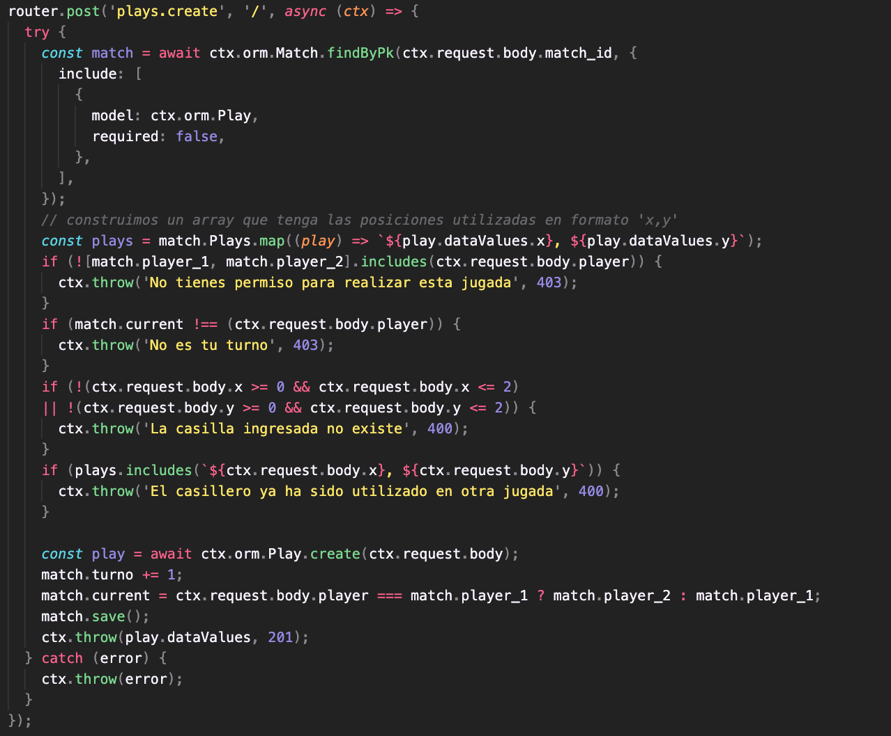
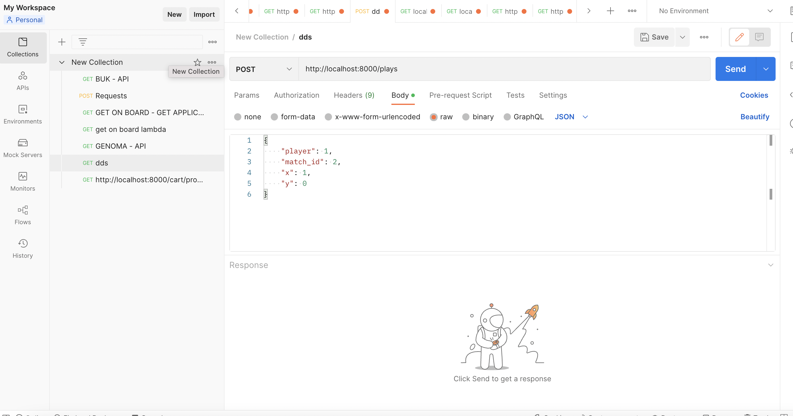
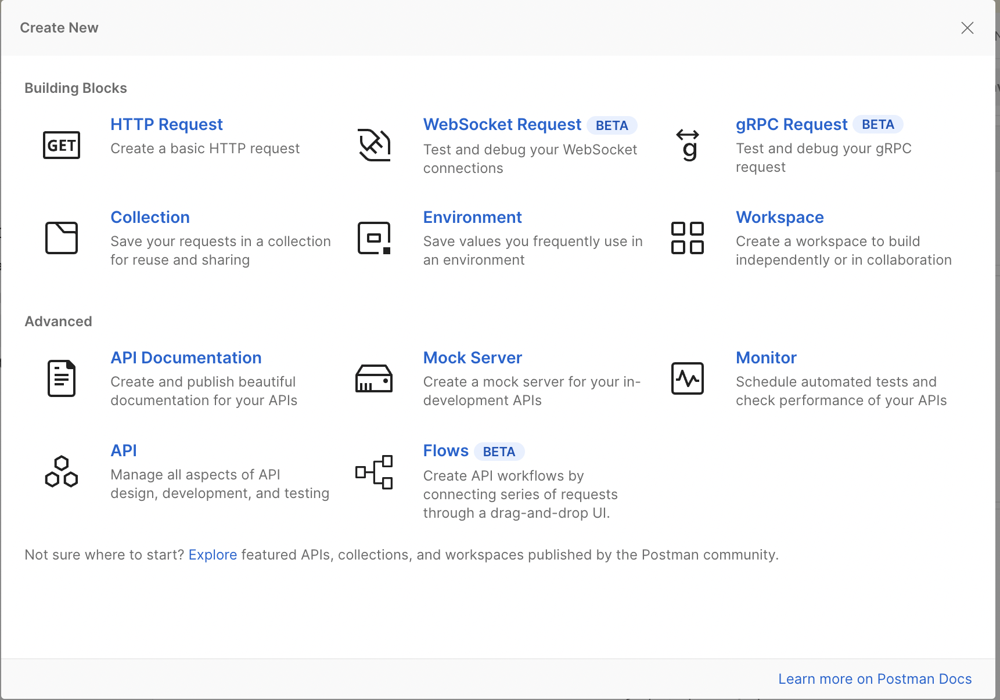
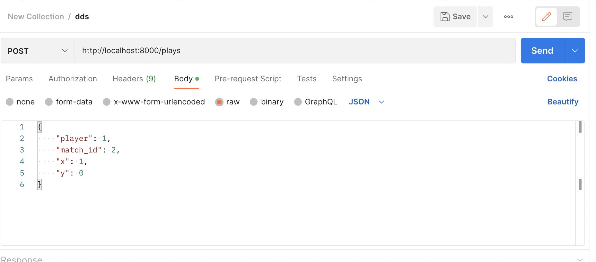
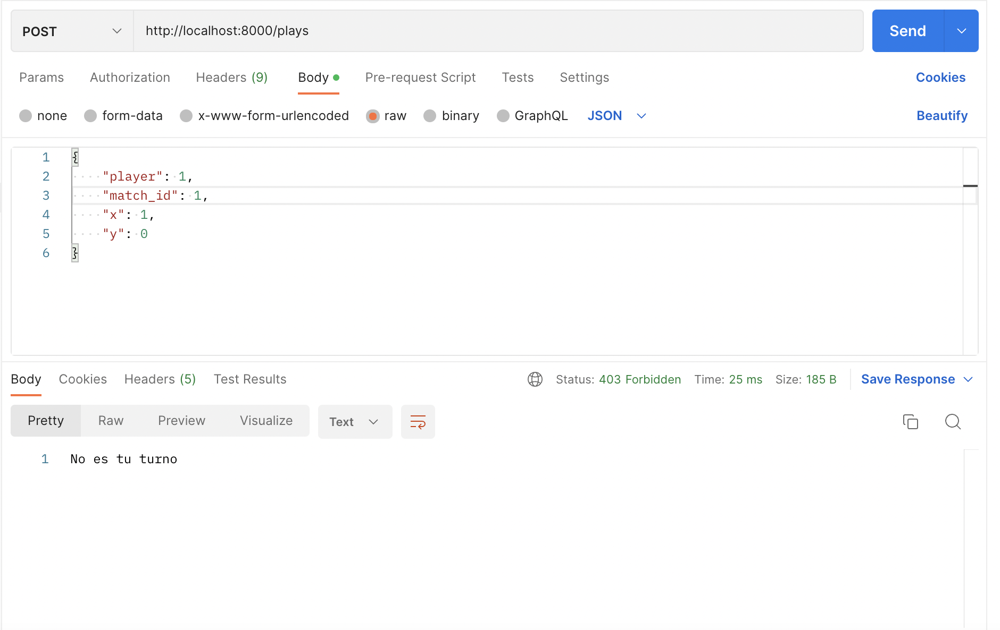
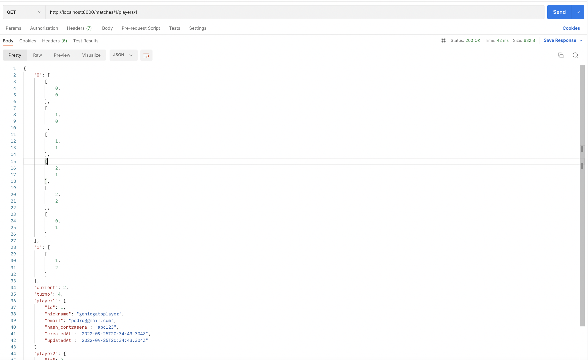

# Conexión con la API

## ¿Para que es necesario conectar el frontend con la API?

Actualmente, nuestro proyecto cuenta con un repositorio para el backend y otro para el frontend. Si deseamos que ambos interactúen entre sí, logrando desencadenar acciones desde el frontend a partir de reglas establecidas por el backend y datos recopilados a nivel de frontend es necesario conectar este último con la API.

## Definiciones importantes
### ¿Qué es un endpoint?

Un endpoint de una API(en este caso del backend de la aplicación) es el extremo de una conexión de API, donde se recibe una llamada.

En otras palabras, es una función que posee tres elementos importantes:
1. Una ruta, la cuál determina el path al que se debe consultar para realizar la acción que realiza el endpoint
2. Un método http, que puede ser get, post, delete, patch, entre otros.
3. Código sobre alguna acción que se busca obtener luego de hacer la llamada a este endpoint, entre estos pueden ser: crear un recurso, obtener la lista de recursos disponibles, entre otros. 

Por lo general cada modelo suele tener los 4 endpoints básicos(CRUD) sin embargo, esto no implica que estos deban estar siempre ni que se limite a tener sólo estos endpoints, ya que se pueden crear tantos como encuentren convenientes y sean relevantes para la aplicación que esten construyendo. 

La siguiente imagen muestra la estructura de un endpoint básico.



Un endpoint puede recibir body o no dependiendo del tipo de método que se envía a través de la request. Por lo general, un endpoint recibe un body si el método http que lo define es de tipo POST o PATCH, mientras que los métodos GET y DELETE comunmente no llevan body ya que no es considerado una buena práctica y muchas librerías que entregan conexión(como la que veremos) no soporta que estos lleven body.

Para acceder a el body de una request desde un endpoint se debe hacer lo siguiente:

```
ctx.request.body
```

### ¿Qué son los HTTP status code?
Para poder manejar de la mejor forma el comportamiento de los endpoints, recomendamos fuertemente el uso de los status de http, los cuales son útiles para manejar errores y consultas exitosas a la API, facilitando el manejo de las requests en el frontend.
Los status más comunes se pueden encontrar en: [STATUS CODES LIST](https://rapidapi.com/guides/http-status-code?utm_source=google&utm_medium=cpc&utm_campaign=DSA&gclid=Cj0KCQjw1vSZBhDuARIsAKZlijSg8-KWW5UML9gDiNUrg-pr3XnJPxpIaw6eRoSVByzu39_0piqtKykaAmrqEALw_wcB)

## Conexión Frontend - Backend
### Axios
Axios es una librería de React(por lo que se debe instalar en el frontend) que permite la conexión del backend al frontend mediante requests. Para realizar esto, es importante instalar la librería con el siguiente comando:
```
yarn add axios
```
Una vez que la librería se encuentre en el archivo package.json podemos conectar el frontend a la API

#### Paso 1: Crear el archivo de entorno

Crear un archivo .env, y en este cree una variable que indique la ruta en la que se encontrará el servidor, es decir l API a la que se debe conectar el frontend.

En el repositorio de DCCAT_FRONT, se añadió la siguiente variable al ambiente.
```
REACT_APP_SERVER_URL="http://localhost:8000"
```
Como consideración, recuerden que este archivo siempre debe estar incluido en el .gitignore

Para poder utilizar la variable definida en el archivo es necesario acceder a esta mediante process.env.nombre_de_la_variable, por ejemplo:
```
const URL = process.env.REACT_APP_SERVER_URL
```
#### Paso 2: Realizar una request
Como ya tenemos la librería para hacer las requests y a su vez, tenemos la variable de ambiente que nos indica donde se está corriendo el servidor al cual queremos consultar, podemos realizar las primeras requests a la API.

Para esto, debemos por un lado tener claro a que endpoint buscamos consultar, que método lo define y cual es su ruta. En caso de que espere un body, enviarle el body al momento de realizar la request.

En caso del archivo Game.js del repositorio dccat-front, se siguieron los siguientes pasos para establecer la conexión:
1. Importar la librería axios a la vista, de esta forma, podemos utilizarla en el archivo.
2. Obtener el url donde se encuentra el servidor mediante process.env.REACT_APP_SERVER_URL
3. Crear una función que desencadenara la consulta a la api
```
  const newPlay = async () => {
    const tiles = document.getElementsByClassName("Tile")
    const url = `${SERVER_URL}/plays`;
    const body = {
      x: 0,
      y: 1,
      player: playerId,
      match_id: matchId,
    };
    await axios
      .post(url, body)
      .then((response) => {
        alert(` JUGADA CONCRETADA EN (${body.x}, ${body.y})`);
        tiles[body.x * 3 + body.y].firstElementChild.innerText = "X"
      })
      .catch((error) =>
        alert(`[${error.response.status}] ${error.response.data}`)
      );
  };
```
En este código podemos ver la siguiente estructura:
1.  Se define el url al que se busca consultar, lo que realmente significa a la ruta que define al endpoint específico para crear una jugada en el servidor. 
2.  Por otro lado al querer postear una jugada, se crea el cuerpo de la función con todos los atributos que se esperan recibir, que en este caso son x,y, player, match_id.
3.  Se realiza la request mediante axios, la cual detalla el método http que se está empleando y lo que se envía para realizar la request(por ahora un url y un body) y luego según la respuesta entregada por el servidor se desencadena una acción:
    1.  Si la respuesta es correcta(o tiene un status menor a 400), se crea la jugada y se levanta una alerta de jugada concretada
    2.  Mientras que en otro caso se levanta una alerta definida con los posibles errores que se pueden ir encontrando a medida que se va programando.

Los errores que pueden ir saliendo son los que se van declarando en el endpoint, que justamente en este caso es el de la imagen expuesta más arriba.

4. Por último se debe crear alguna forma para llamar a la función que hace la request a la API, esto puede ser mediante un botón, la edición de datos, entre otros.


## Herramienta útil de programación: Postman
Postman es una aplicación que facilita el testeo de endpoints de una API, mediante la creación de requests a través de esta.

#### Instalación de la aplicación
https://www.postman.com/downloads/


#### Realizar una request
Para realizar una request, nuevamente es necesario saber el url del endpoint cque queremos consultar, el método http y si es necesario el body que necesitamos enviar.

Para crear una request es necesario seguir estos pasos:
1. Presionar el botón NEW

2. Se abrirá este modal, por lo que deberán seleccionar HTTP Request
 
3. Crear la request
   

Intuitivamente podemos notar que el método HTTP se elige en el select que está a la izquierda de la imágen, y el input que lo sigue se ingresa la ruta del endpoint. 

Sin embargo, la configuración del body no es tan intuitiva. Para crear el body, se necesita seleccionar el apartado que sale "Body" justo abajo del cuadro de texto que se ingresa la ruta. Y luego seleccionar la opción "raw" entre las que se encuentran disponibles(none, form-data, x-www-form-urlencoded, raw, binary, GraphQL). Una vez seleccionada la opción raw, se encontrará un select que posee distintas opciones(text, JSON, JavaScript, HTML, XML), seleccionen JSON. Luego de eso pueden ingresar el body de la request, respetando el formato json.

Una vez que todo esto se encuentre correcto se puede presionar send y ver si la request recien hecha entrega efectivamente lo que pensaron que realizaba.

#### Evaluar la correctitud de la response
Para saber si el endpoint está correcto, no basta con revisar solo el happy path, sino que es de suma importancia evaluar cada paso crítico en que la respuesta debería arrojar error. En función de esto, una vez realizada una consulta por postman, la aplicación debería entregar una respuesta de este estilo:

Por ejemplo, si intento de realizar una jugada cuando no es mi turno, postman me entrega la siguiente respuesta
   
   donde se ve que el estado sale 403 Forbidden y como mensaje se observa "No es tu turno"

Mientras que una request correcta entrega lo siguiente
   
   donde se ve que el estado sale 200 OK y como mensaje se observa el estado del tablero. Al ser una consulta tipo GET, esta request no lleva body.
